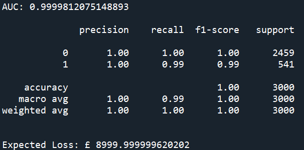

# loan-default-risk-and-expected-loss-prediction-model
Calculates probability of default for loan borrowers and expected loss using logistic regression for classification with a expected loss formula.

## Features 

-	Loads 10000 row and 8 column data file

-	Splits data to train and test a logistic regression model used to then predict default probability

-	Prints a ROC AUC score for the model with a classification report

-	Includes a function computing the expected loss using equation: expected loss = PD x (1- recovery rate) x exposure

## Example Output

  

## Usage

Requires the dataset to be labelled ‘Task_3_and_4_Loan_Data.xlsx’ in the project folder, within it being columns (credit lines outstanding, loan amt outstanding, total debt outstanding, income, years employed, fico score, default)
